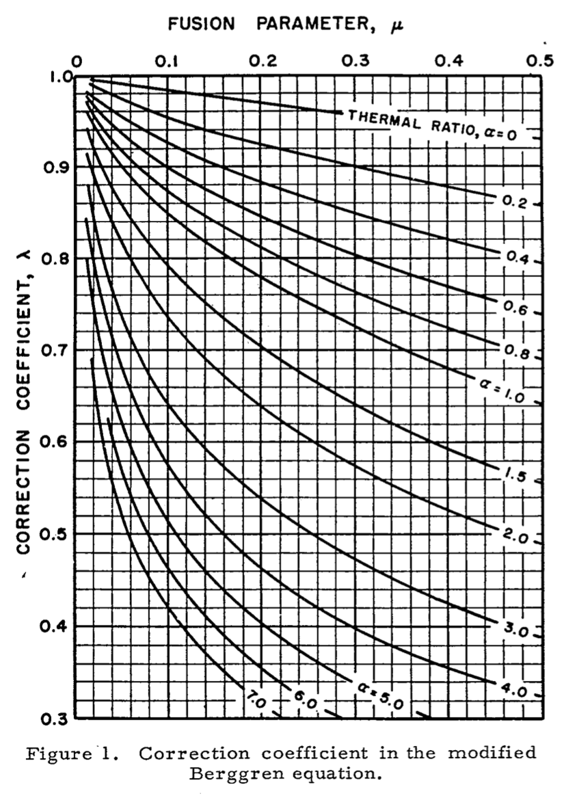

# A Modified Berggren Frost Depth Computer for a Changing Alaskan Climate

## Background
From Bianchini and Gonzalez (2012)[[1]](#1):

*"The design of pavement structures in cold climates must account for the changes in soil properties due to the influence of freezing and thawing cycles. The calculation of **frost depth** is a fundamental step during the design and evaluation of pavement structures by the U.S. Department of Defense (DoD). The DoD uses the modified Berggren (ModBerg) equation to compute the frost penetration depth."*

The functions provided here compute the ModBerg frost depth in the same fashion as demonstrated in the The Unified Facilities Criteria (UFC) 3-130-06[2](#ufc). Note that other tools (in particular the Pavement-Transportation Computer Assisted Structural Engineering (PCASE)) offer numerical solutions to the ModBerg equation and thus predict different values than the solutions described in the UFC and presented here. See [1](#bianchini) for a discussion of those differences.

## Implementation
### Structure
The Python code in `modberg.py` computes the frost depth. A simple web app (`app.py`) built using the Streamlit platform enables a web based graphical user interface to the tool.

### Assumptions
 - Frost depth is computed for a single layer of homogenous isotropic soil.
 - The coeffcient λ is computed as a function of the fusion parameter μ and thermal ratio α. Traditionally, λ is found "manually" by using values of μ and α to consult a chart such as this one from Aldrich and Paynter (1966)[4](#aldrich1966): 

In the implemenation provided here, λ is found using one the original equations provided by Alrdich (1953) where gamma is found to be the inverse of the square root. This gamma method removes the manual consultation and should produce gammas suitable for high latitudes (where the thermal ration is low), though likely will over estimate frost depths for more temperate climates.

### User Inputs
 - Soil Factors
     + Thermal Conductivity
     + Dry Density
     + Water Content
 - Climate Factors
     + Mean Annual Temperature
     + Freezing Index
     + Duration of the Freezing Season

## References
 
<a id="1">[1]</a> W. P. Berggren, “Prediction of temperature-distribution in frozen soils,” Trans. AGU, vol. 24, no. 3, p. 71, 1943, doi: 10.1029/TR024i003p00071.

[2]H. P. Aldrich and H. M. Paynter, “Analytical Studies of Freezing and Thawing of Soils,” Arctic Construction and Frost Effects Laboratory, Corps of Engineers, U.S. Army, Boston, MA, First Interim Technical Report 42, Jun. 1953.

[3]H. P. Aldrich and H. M. Paynter, “Depth of Frost Penetration in Non-Uniform Soil,” Conducted for CORPS OF ENGINEERS, U. S. ARMY by U.S. ARMY MATERIEL COMMAND COLD REGIONS RESEARCH & ENGINEERING LABORATORY, Hanover, New Hampshire, Special Report 104, Oct. 1966.

[4]“ARCTIC AND SUBARCTIC CONSTRUCTION CALCULATION METHODS FOR DETERMINATION OF DEPTHS OF FREEZE AND THAW IN SOILS,” Joint Departments of the Army and Air Force, USA, Technical Manual Tm 5-852-6 / AFR 88-19, Volume 6, Jan. 1988.

[5]“Calculation Methods for Determination of Depth of Freeze and Thaw in Soil: Arctic and Subarctic Construction,” U.S. Army Corps of Engineers, United Facilities Criteria UFC 3-130-06, Jan. 2004. [Online]. Available: https://www.wbdg.org/FFC/DOD/UFC/INACTIVE/ufc_3_130_06_2004.pdf

[6]A. Bianchini and C. R. Gonzalez, “Pavement-Transportation Computer Assisted Structural Engineering (PCASE) Implementation of the Modified Berggren (ModBerg) Equation for Computing the Frost Penetration Depth within Pavement Structures,” Geotechnical and Structures Laboratory U.S. Army Engineer Research and Development Center, Vicksburg, MS, Final ERDC/GSL TR-12-15, Apr. 2012. doi: 10.21236/ADA559915.

[7]H. P. Aldrich, “Frost Penetration Below Highway And Airfield Pavements,” p. 26.
